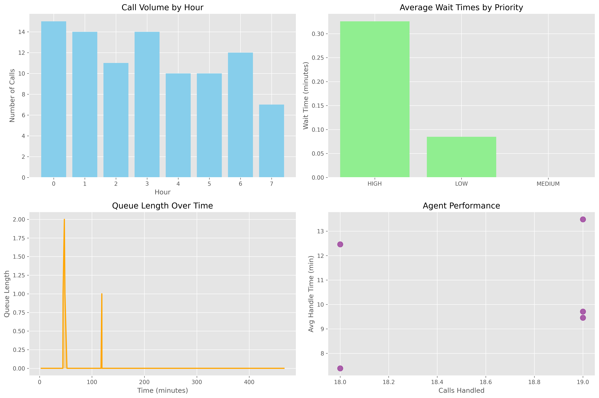

```markdown
# Call Center Data Analysis

This project analyzes call center data to generate insights on key performance metrics, including call volume, wait times, queue lengths, and agent performance. The goal is to help call centers optimize their operations by identifying patterns in call handling and response times.

## Files in This Repository
- **main.py**: The main script for processing and visualizing call center data.
- **call_center_analysis.png**: A screenshot of the generated visualizations.
- **README.md**: Documentation for the project.

## Installation
1. Clone this repository:
   ```sh
   git clone https://github.com/your-username/call-center-analysis.git
   cd call-center-analysis
   ```
2. Install the required dependencies:
   ```sh
   pip install -r requirements.txt
   ```

## Running the Script
To execute the script and generate visualizations, run:
```sh
python main.py
```

## Visualizations
Below is a sample visualization generated by the script:



### Key Metrics
- **Call Volume by Hour**: Number of calls received each hour.
- **Average Wait Times by Priority**: Comparison of wait times based on priority levels.
- **Queue Length Over Time**: Trends in queue length throughout the monitoring period.
- **Agent Performance**: Analysis of agent efficiency based on calls handled and average handling time.


